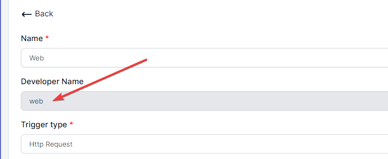
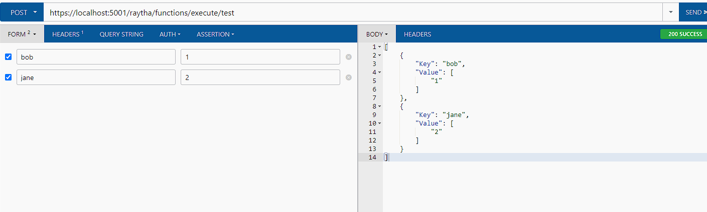

# Http Request Trigger Type for Raytha Functions

## The Structure

When you create a Raytha Function with an `Http Request` trigger, this automatically creates an endpoint that is accessible at the following URL pattern:

> /raytha/functions/execute/{developerName}

The developer name is specified when you create the function in the Raytha platform.



At this endpoint, you can submit GET and POST requests so long as you keep the structure of the functions that are provided to you in boilerplate fashion. This means you need to implement `get(query)` and `post(payload, query)`

The default code provided to you is the following:

```
    /** The following classes are available:
     * API_V1
     * CurrentOrganization
     * CurrentUser
     * Emailer
     * HttpClient
    */

    /** 
     * Receives a get request at /raytha/functions/execute/{developerName}
     * @param {IQueryCollection} query Passed in from .NET's Request.Query
     * @returns {object} of type JsonResult, HtmlResult, RedirectResult, or StatusCodeResult
     */
    function get(query) {
        return new JsonResult({ success: true });
        //example 1: return new HtmlResult("<p>Hello World</p>");
        //example 2: return new RedirectResult("https://raytha.com");
        //example 3: return new StatusCodeResult(404, "Not Found");
    }

    /** 
     * Receives a post request at /raytha/functions/execute/{developerName}
     * @param {IFormCollection} payload Passed in from .NET's Request.Form
     * @param {IQueryCollection} query Passed in from .NET's Request.Query
     * @returns {object} of type JsonResult, HtmlResult, RedirectResult, or StatusCodeResult
     */
    function post(payload, query) {
        return new JsonResult({ success: true });
        //example 1: return new HtmlResult("<p>Hello World</p>");
        //example 2: return new RedirectResult("https://raytha.com");
        //example 3: return new StatusCodeResult(404, "Not Found");
    }
```

## Return types

When you return from the `get` or `post` functions, Raytha is expecting an object of one of the following types:

* `JsonResult(object)`
* `HtmlResult(string: html)`
* `RedirectResult(string: url)`
* `StatusCodeResult(int: status_code, string: message)`

The above section includes commented out examples of each.

## GET endpoint

If you receive a GET request, Raytha will run the `get(query)` function. The paramater provided here will populate with a collection of query parameters that were provided as part of the request. For example, `/raytha/functions/execute/myfunction?bob=1&jane=2` will come through in query parameter like so:

```
[
  {
    "Key": "bob",
    "Value": [
      "1"
    ]
  },
  {
    "Key": "jane",
    "Value": [
      "2"
    ]
  }
]
```

A good way to test is to simply return the object back out in a JsonResult like so:

```
    function get(query) {
        return new JsonResult(query);
    }
```

To pull the values out in the example above, you can use standard javascript.

```
    function get(query) {
        let bobsValue = query.find(item => item.Key === "bob").Value[0];
        let janesValue = query.find(item => item.Key === "jane").Value[0];
        return new JsonResult({
            'Bob': bobsValue,
            'Jane': janesValue
        });
    }
```

## POST endpoint

Everything from the `GET endpoint` above applies to the POST endpoint as well, with the only difference being that there is a payload object which includes the body of the request, for situations such as receiving a form submission or posted JSON.

If a Request.Form was submitted, `payload` outputs in a similar manner:

```
[
    {
        "Key": "bob",
        "Value": [
            "1"
        ]
    },
    {
        "Key": "jane",
        "Value": [
            "2"
        ]
    }
]

Otherwise, if you posted JSON, it will pass it through.
```



## Next

To get the real value out of Raytha Functions, you pair the above with the built-in objects and API layer that is made accessible to you.

[Learn how to make use of built-in objects](/articles/embeddable_functions_builtinobjects.html).


