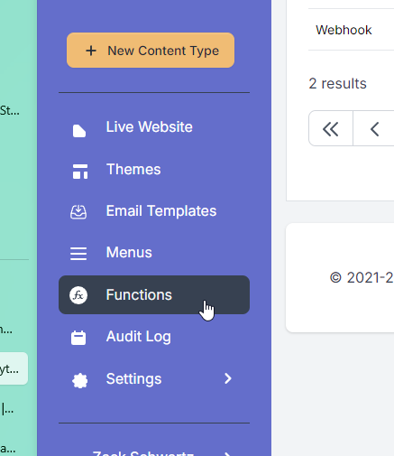
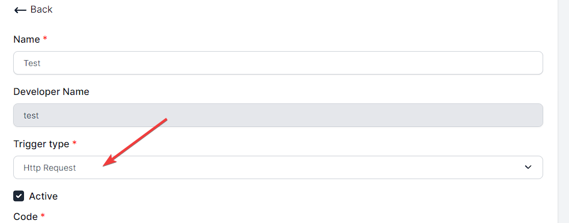

# Embed Functions Inside Raytha with Custom Code

## Introduction to Raytha Functions

Raytha Functions are a way to write custom code in the administrator portal of Raytha to add functionality to your application. Use cases for this include but are not limited to:

* Create your own custom api endpoints
* Accept form submissions and save response
* Send an email out of the platform
* Make an external HTTP call and return and/or save result
* [Coming Soon] Webhooks trigger functionality
* [Coming Soon] Timer trigger functionality

In a way, it is effectively writing "code behind" directly into the platform.

## Writing code behind

When you write code for a Raytha Function there are few items you need to be aware of.

* <strong>Write your code in javascript.</strong> The code is compiled and run using Microsoft's ClearScript engine which works with V8 implementation of javascript. This gives you access to basic engine javascript. 
* <strong>Triggers.</strong> Functions are triggered by some action. You select the trigger type when you create the function.
* <strong>Built-in objects.</strong> The javascript by itself would not be of much use if you did not have layer of access to the database and other core functionality.

## Triggers

Raytha Functions are triggered by some action. You select the trigger type when you create the function.

Triggers come with boilerplate code that the ClearScript engine runs when necessary. Click the link below to learn how to write code for each trigger type.

* [Http Request](/articles/embeddable_functions_httprequest.html)
* [Coming Soon] Timer
* [Coming Soon] Webhook

## Built-in Objects

To provide valuable functionality to you while you write Raytha Functions, the following objects are included in the ClearScript engine that you can call.

| Object                             | Notes              |
| ------------------------------     | ------------------|
| API_V1                             | API to Raytha's Application Layer |
| CurrentOrganization                | Object with access to the current org settings like name, timezone, etc. |
| CurrentUser                        | Information about the current logged in user |
| Emailer                            | Send an email from the platform |
| HttpClient                         | Make an external API call |

[Learn how to make use of these objects](/articles/embeddable_functions_builtinobjects.html).