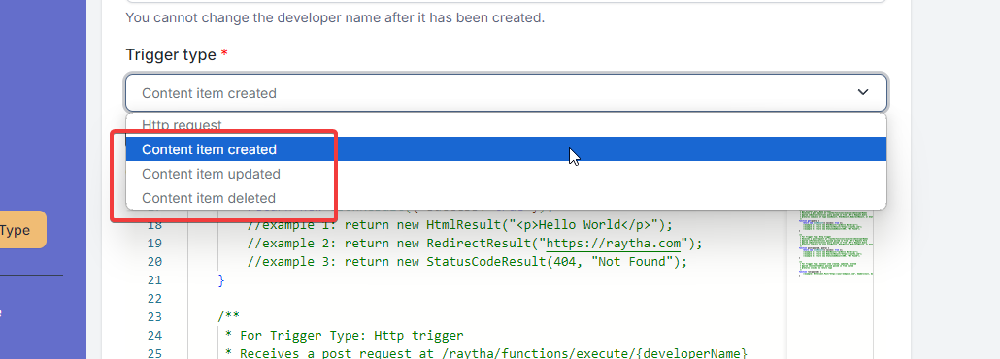

# Http Request Trigger Type for Raytha Functions

## The Structure

When you create a Raytha Function with a `Webhook` style trigger, you can take action within the platform when a content item is created, updated, or deleted.



In order to run code when you hit one of these triggers, you need to implement the `run(payload)` function.

The default code provided to you is the following:

```
    /** The following classes are available:
     * API_V1
     * CurrentOrganization
     * CurrentUser
     * Emailer
     * HttpClient
    */

    /**
     * For Trigger Type: Content item created, updated, deleted
     * @param {ContentItemDto} payload passed in from system
     * @returns {void}, no return type
     */
    function run(payload) {
        //example: HttpClient.Post("https://your-endpoint.com", headers=null, body=payload);
    }
```

You might see other boilerplate code for other trigger types. You can leave that code there or remove that code as it will not be used.

## Return types

There is no return type. The `run(payload)` function returns void.

## run(payload)

When your trigger is hit, Raytha will run the `run(payload)` function. The paramater provided here will populate a ContentItemDto passed in from the system.

Commonly, you can use `HttpClient` to make an API call out of the platform to post a webhook to an external service.

## Next

To get the real value out of Raytha Functions, you pair the above with the built-in objects and API layer that is made accessible to you.

[Learn how to make use of built-in objects](/articles/embeddable_functions_builtinobjects.html).


