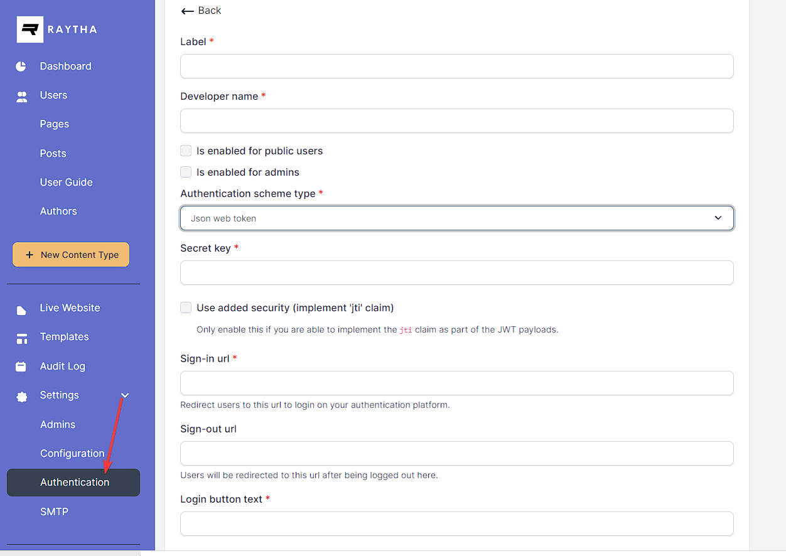

# Build a Json Web Token SSO with Raytha

Json web tokens (JWT) are a protocol for allowing an identity provider sign your users in to the Raytha platform. Raytha supports SSO for both public users and administrators.

## Create the authentication scheme

In order to build an SSO where you can log users and/or administrators into Raytha using JWT, you must first login to the Raytha admin portal and add a new authentication mechanism by clicking Authentication on the left side navigation under Settings.



Be sure to select `Json web token` as the authentication scheme type.

Complete the information for the setup. The `Sign-in url` will be your endpoint that Raytha will direct users to if they are not logged into the platform.

> Note: You can hardcode a "click here to login" style button or link with the format /login/sso/{developer_name} (for public login) or /raytha/login/sso/{developer_name} (for admins)

## Implement your endpoint

If an anonymous visitor to your raytha website tries to access a page that requires the user to be logged in, the system will redirect the user to the endpoint you specified as the `Sign-in url` in the configuration settings.

It will attach, as a query parameter, `raytha_callback_url`. You will want to redirect the visitor back to the url specified at that parameter upon a successful login in your system.

<strong>Minimum JSON Payload</strong>

The minimum required JSON payload for a valid authentication will be something like:

```
{
    "exp": 1516239022,
    "email": "johndoe@test.com"
}
```

`email` attribute is the email address of the visitor. If the visitor has no email, you can generate a unique fake one. The `exp` attribute is the expiration attribute, the UNIX time stamp (seconds from epoch) for when this token expires and is no longer valid. 

<strong>Full JSON Payload</strong>

In your authentication scheme configuration, you have the option to require the `jti` attribute for higher security. If this is the case, you must pass in the `jti` attribute with a unique string that is not re-used in future login attempts. A good candidate for a `jti` is to use GUIDs.

You can also specify `given_name` and `family_name` to give your visitor a name. Otherwise, raytha will generate a fake name with the format `SsoVistor {randomVal}`.

Optionally, you can include the `sub` attribute which can be a unique id for the user in your database. This is useful if you do not want to use `email` as the unique identifier. Otherwise, if no `sub` is included, the system will fall back to checking against the email address. If no email address is found, it will assume it is a new user. This can result in duplicate accounts if you allow users to change their email addresses. Therefore, including the `sub` attribute is considered a best practice.

Lastly, if you want to [make use of User Groups for additional access controls](https://raytha.com/user_guide/Setup-user-groups-to-support-advanced-public-page-access) on public users, you can include the `groups` attribute, and pass in an array of strings that match the developer names for the groups you created in the Raytha's admin portal.

Here is a full example:

```
{
    "exp": 1516239022,
    "given_name": "John"
    "family_name": "Doe"
    "email": "johndoe@test.com",
    "sub": "123456"
    "groups": ['group_developer_name1', 'group_developer_name2']
}
```

> Note: if you leave out an attribute entirely that was previously set, it will leave that value undisturbed in the raytha platform. If you provide that value in the JSON payload, it will override what is set on the user's profile in raytha upon successful authentication.