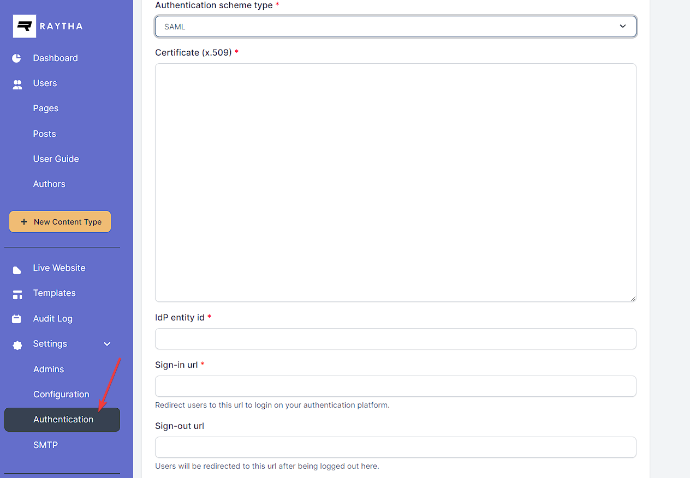

# Configure SAML to login users in to Raytha

We encourage you read through this blog post on [everything you need to know about SAML2 as a .NET developer](https://raytha.com/blog/Everything-NET-Devs-Need-to-Know-About-Authenticating-With-SAML2).

Raytha supports a simple SAML login implementation. It is tested and works at least with Google Workspace's SAML login, which serves as a good standard to test against.

## Create the authentication scheme

In order to build an SSO where you can log users and/or administrators into Raytha using SAML, you must first login to the Raytha admin portal and add a new authentication mechanism by clicking Authentication on the left side navigation under Settings.

Be sure to select `SAML` as the authentication scheme type. Your developer name that you specify during configuration will determine your ACS Url that you will need to provide the IT administrator on the IdP side.

Your ACS url will follow the format:

- (for public users and admins): https://yourdomain.com/account/login/saml/{developer_name}
- (for admin only login): https://yourdomain.com/raytha/login/saml/{developer_name}

Provide the ACS url to your IT administrator.

They should provide you with the sign in url, entity id, and x509 certificate values.

## SAML Assertions

There is only 1 required custom SAML assertion, which is the `email` assertion.

Beyond that, you can choose to include the: `NameID` which can be a unique ID for the user.

Optional SAML assertions:

- `given_name`
- `family_name`
- `groups`

If you do not provide a `given_name` and `family_name`, the raytha platform will generate a fake name with the format `SsoVisitor {randomVal}`.

Lastly, if you want to [make use of User Groups for additional access controls](https://raytha.com/user_guide/Setup-user-groups-to-support-advanced-public-page-access) on public users, you can include the `groups` saml assertion, and pass in an array of strings that match the developer names for the groups you created in the Raytha's admin portal.
