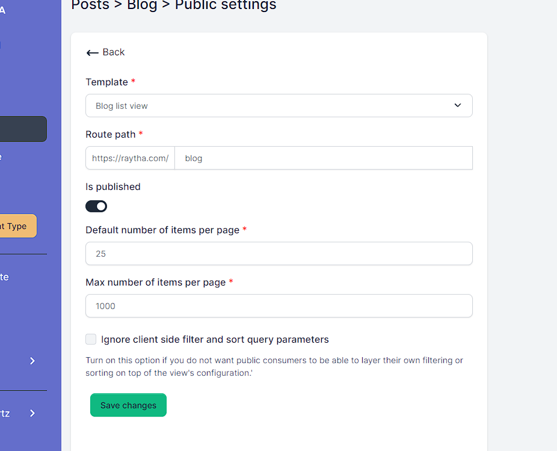
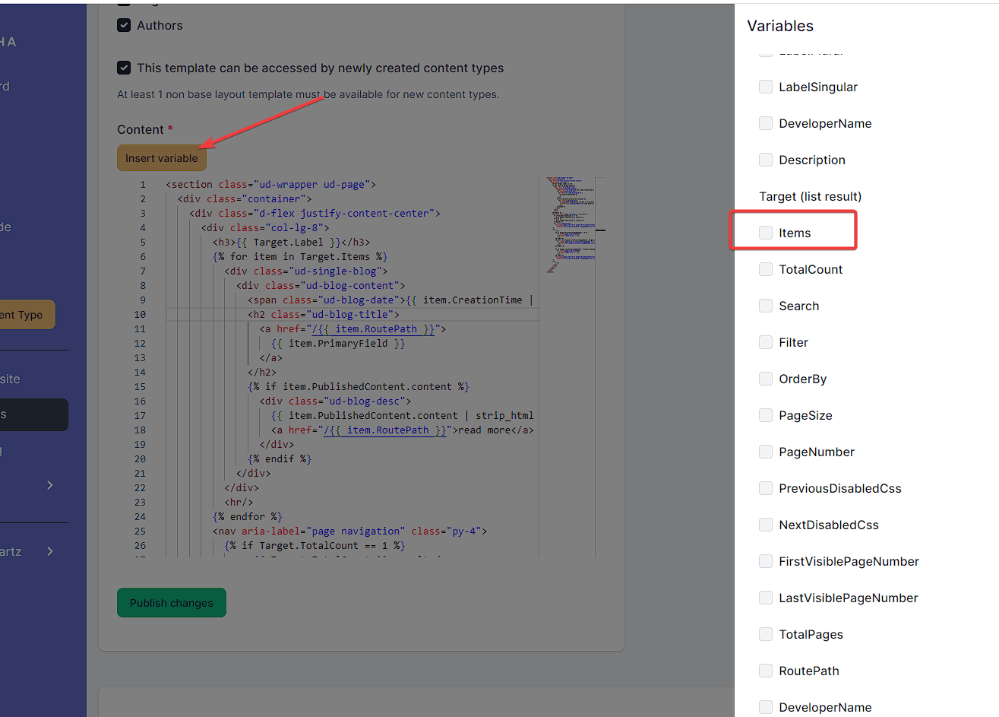

# Build custom Raytha templates

## Migrate a static site to a CMS

We highly recommend watching our YouTube video where we demonstrate the process of migrating a static website hosted on Github Pages to the Raytha platform. By following along with the video, you can gain valuable insights and learn how to successfully migrate your own website.

[](https://www.youtube.com/watch?v=6iXkLkaWH6Q)

## Understanding parent/child templates

To effectively build Raytha templates, it's important to grasp the concept of creating a layout template that can be inherited by other templates. By default, all users are given a `_Layout` parent template.


When you create or modify a Raytha template, it's important to understand that you can choose to inherit from a parent template and also specify whether the template you're creating will serve as a parent to other templates.

In case you are creating a parent template, make sure to include the `` tag in your HTML code, otherwise, an error will be thrown. This tag is essential as it indicates where the content of the child template will be rendered.


> Note: There is a depth limit for inheretence of 5 levels deep.

## Explanation of variables

To get the most out of Raytha templates, it's essential to understand the role of variables. With Raytha, variables and liquid syntax allow for full flexibility in rendering the content types you have configured. To insert a variable, simply open the template you want to edit and click on the "Insert variable" button. From there, you can search for the desired variable and copy and paste it into the template editor. By mastering variables and liquid syntax, you can take full control of your templates and achieve the desired rendering for your content.


There are many variables available to you. Below are some of the common ones you might find yourself using regularly.

| Variable                                | Type              | Notes                             |
| -----------------------------------     | ------------------|---------------------------------- |
| QueryParams                             | Key-Value         | {{ QueryParams['yourParam'] }}    |
| PathBase                                | String            | If site is hosted at a /route     |
| CurrentUser.IsAuthenticated             | Boolean           |                                   |
| CurrentUser.IsAdmin                     | Boolean           |                                   |
| CurrentUser.Roles                       | Array             |                                   |
| CurrentUser.UserGroups                  | Array             |                                   |
| CurrentUser.LastModificationTime        | Date              |                                   |
| CurrentUser.UserId                      | String            |                                   |
| CurrentUser.FirstName                   | String            |                                   |
| CurrentUser.LastName                    | String            |                                   |
| CurrentUser.EmailAddress                | String            |                                   |
| CurrentOrganization.OrganizationName    | String            |                                   |
| ContentType.LabelPlural                 | String            |                                   |
| ContentType.LabelSingular               | String            |                                   |
| ContentType.DeveloperName               | String            |                                   |
| ContentType.Description                 | String            |                                   |

The `Target` variable is a crucial component in Raytha templates, as it is linked to the content being rendered. Its value is either the list of content items if the template is a list view or the individual content item if the template is a detail view. More information about how Target is used in each context will be provided below.

## Detail view vs List view templates

In Raytha, every page that is publicly rendered either points to an individual content item or a list view of a content type. We refer to these as detail views and list views, respectively.

### List views

You can have multiple list views and they are configurable in your content type where you can publish or unpublish a list view.


To set the properties of a list view in Raytha, you can specify various options such as the template it should use, the route path, its publication status, and default pagination settings. Additionally, you can choose to ignore any search, filter, or sort parameters specified in query parameters from the public side and only use the view's specified configuration.



> Note: You can also set a list view as a home page if you want to.

To optimize your list view templates, you can incorporate variables that allow you to iterate through a list of items using the `Target.Items` variable. When used in conjunction with the `item.PrimaryField` and `item.RoutePath` variables within a for-loop, this technique is particularly effective. In addition, it's common to access the `PublishedContent` attribute to gain access to each content item's fields via their developer name.



The code to loop through with liquid will be:

```

    <div class="ud-single-blog">
    <div class="ud-blog-content">
        <span class="ud-blog-date">{{ item.CreationTime | date: "%b %d, %Y" }}</span>
        <h2 class="ud-blog-title">
        <a href="/{{ item.RoutePath }}">
            {{ item.PrimaryField }}
        </a>
        </h2>
        
        <div class="ud-blog-desc">
            {{ item.PublishedContent.content | strip_html | truncate: 280, "..." }}
            <a href="/{{ item.RoutePath }}">read more</a>
        </div>
        
    </div>
    </div>
    <hr/>

```

It is also common to have pagination on a list view. You can see an example below.

```
<nav aria-label="page navigation" class="py-4">
    
    <p>{{ Target.TotalCount }} result</p>
    
    <p>{{ Target.TotalCount }} results</p>
    
    <ul class="pagination">
    <li class="page-item disabled">
        <a href="/{{ Target.RoutePath }}?pageNumber={{ Target.PageNumber | minus: 1 }}" class="page-link">
            «
        </a>
    </li>
    
        <li class="page-item disabled">
        <a class="page-link">...</a>
        </li>
    
    
        <li class="page-item active">
        <a href="/{{ Target.RoutePath }}?pageNumber={{ i }}" class="page-link">{{ i }}</a>
        </li>
    

    
        <li class="page-item disabled">
        <a class="page-link">...</a>
        </li>
    
    <li class="page-item disabled">
        <a href="/{{ Target.RoutePath }}?pageNumber={{ Target.PageNumber | plus: 1 }}" class="page-link">
            »
        </a>
    </li>
    </ul>
</nav>
```

### Detail views

In a detail view, the `Target` variable directly points to the content item, allowing you to easily reference attributes such as `Target.PrimaryField` or `Target.PublishedContent.content.Value`.

When referencing a custom content field, there are often two child attributes available: `.Text` and `.Value`. In many cases, they may be the same, but sometimes they differ. For instance, on a Checkbox field type, Value will be a liquid boolean type, while Text will be the string representation of "true" or "false". Similarly, for the multiple select field type, Value is an array type, while Text is a string of joined values.

One notable difference is the one-to-one relationship field. In the example below, `author_1` custom field is a one-to-one relationship to an Author content type. `{{ Target.PublishedContent.author_1 }}` by itself will output the primary field of the related content type. However, if you want to reference other fields, you can dig deeper by calling the PublishedContent attribute `{{ Target.PublishedContent.author_1.PublishedContent.twitter_handle.Text }}`

It might be useful to link to the detail view of a related content item with: `{{ Target.PublishedContent.author_1.RoutePath }}`

A more fleshed out example is below.

```

<hr/>
<div class="card mb-3" style="max-width: 100%;">
    <div class="row g-0">
        <div class="col-md-4">
            
        </div>
        <div class="col-md-8">
            <div class="card-body">
            <h5 class="card-title">{{ Target.PublishedContent.author_1 }} <span><a href="https://twitter.com/{{ Target.PublishedContent.author_1.PublishedContent.twitter_handle.Text }}" target="_blank">@{{ Target.PublishedContent.author_1.PublishedContent.twitter_handle.Text }}</a></h5>
            
            <p class="card-text">{{ Target.PublishedContent.author_1.PublishedContent.bio.Text }}</p>
            </div>
        </div>
    </div>
</div>

```

> Note: A current limitation is that access to the content inside variables of a related content type only go 1 level deep.

## Raytha's custom liquid filters


