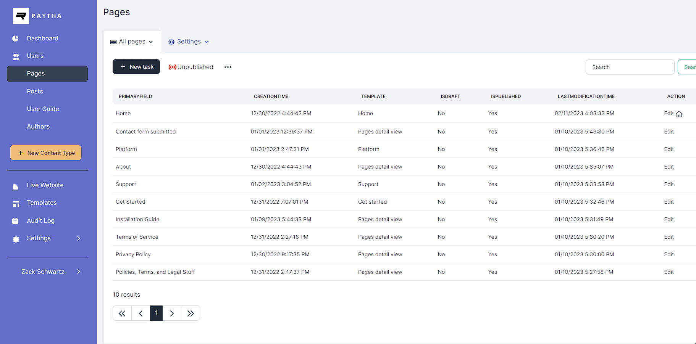
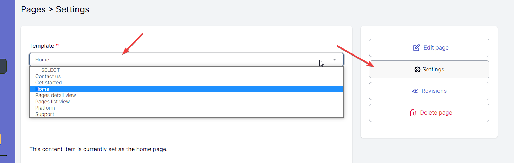

# Detail view vs list view templates

In Raytha, every page that is publicly rendered either points to an individual content item or a list view of a content type. We refer to these as detail views and list views, respectively.

## List views

When you click on a Content Type in the admin panel of Raytha, you are looking at a list view. Below is an example of a user navigating the list view settings:



With a list view, you can:

- Publish the list view (make it publicly accessible)
- Set a list view as the home page
- Define the default pagination settings
- Set the url route, such as /posts
- Set a pre-defined filter conditions
- Set a sort order of the items
- Choose which columns appear and are searchable
- <strong>Choose which template the list view will use to render its items</strong>

You can create multiple list views on a content type and publish some and not publish others. Each list view can use its own template. For example, you may want to one list view that shows a standard directory of items, while another list view renders a dynamic map.

[](https://www.youtube.com/watch?v=yTLwPvAjbCM)

### Configure a list view's settings

To set the properties of a list view in Raytha, you can specify various options such as the template it should use, the route path, its publication status, and default pagination settings. Additionally, you can choose to ignore any search, filter, or sort parameters specified in query parameters from the public side and only use the view's specified configuration.


> Note: You can also set a list view as a home page if you want to.

### Using the Target variable in list view template

To optimize your list view templates, you can incorporate variables that allow you to iterate through a list of items using the `Target.Items` variable. When used in conjunction with the `item.PrimaryField` and `item.RoutePath` variables within a for-loop, this technique is particularly effective. In addition, it's common to access the `PublishedContent` attribute to gain access to each content item's fields via their developer name.


The code to loop through with liquid will be:

```

    <div class="ud-single-blog">
    <div class="ud-blog-content">
        <span class="ud-blog-date">{{ item.CreationTime | date: "%b %d, %Y" }}</span>
        <h2 class="ud-blog-title">
        <a href="/{{ item.RoutePath }}">
            {{ item.PrimaryField }}
        </a>
        </h2>
        
        <div class="ud-blog-desc">
            {{ item.PublishedContent.content | strip_html | truncate: 280, "..." }}
            <a href="/{{ item.RoutePath }}">read more</a>
        </div>
        
    </div>
    </div>
    <hr/>

```

It is also common to have pagination on a list view. You can see an example below.

```
<nav aria-label="page navigation" class="py-4">
    
    <p>{{ Target.TotalCount }} result</p>
    
    <p>{{ Target.TotalCount }} results</p>
    
    <ul class="pagination">
    <li class="page-item disabled">
        <a href="/{{ Target.RoutePath }}?pageNumber={{ Target.PageNumber | minus: 1 }}" class="page-link">
            «
        </a>
    </li>
    
        <li class="page-item disabled">
        <a class="page-link">...</a>
        </li>
    
    
        <li class="page-item active">
        <a href="/{{ Target.RoutePath }}?pageNumber={{ i }}" class="page-link">{{ i }}</a>
        </li>
    

    
        <li class="page-item disabled">
        <a class="page-link">...</a>
        </li>
    
    <li class="page-item disabled">
        <a href="/{{ Target.RoutePath }}?pageNumber={{ Target.PageNumber | plus: 1 }}" class="page-link">
            »
        </a>
    </li>
    </ul>
</nav>
```

### Using OData for filtering and searching

One of the powerful aspects of Raytha's templating system is that it makes use of OData so that you can output any subset of the content type you are looking to pull. You can filter, sort, and paginate on these items by following the OData syntax as described [in OData with Templates](/articles/templates_odata.html).

## Detail views

A detail view is tied an individual content item. You can change which template detail view a content item uses by opening that content item's settings as shown below.



In a detail view, the `Target` variable directly points to the content item, allowing you to easily reference attributes such as `Target.PrimaryField` or `Target.PublishedContent.content.Value`.

When referencing a custom content field, there are often two child attributes available: `.Text` and `.Value`. In many cases, they may be the same, but sometimes they differ. For instance, on a Checkbox field type, Value will be a liquid boolean type, while Text will be the string representation of "true" or "false". Similarly, for the multiple select field type, Value is an array type, while Text is a string of joined values.

One notable difference is the one-to-one relationship field. In the example below, `author_1` custom field is a one-to-one relationship to an Author content type. `{{ Target.PublishedContent.author_1 }}` by itself will output the primary field of the related content type. However, if you want to reference other fields, you can dig deeper by calling the PublishedContent attribute `{{ Target.PublishedContent.author_1.PublishedContent.twitter_handle.Text }}`

It might be useful to link to the detail view of a related content item with: `{{ Target.PublishedContent.author_1.RoutePath }}`

A more fleshed out example is below.

```

<hr/>
<div class="card mb-3" style="max-width: 100%;">
    <div class="row g-0">
        <div class="col-md-4">
            
        </div>
        <div class="col-md-8">
            <div class="card-body">
            <h5 class="card-title">{{ Target.PublishedContent.author_1 }} <span><a href="https://twitter.com/{{ Target.PublishedContent.author_1.PublishedContent.twitter_handle.Text }}" target="_blank">@{{ Target.PublishedContent.author_1.PublishedContent.twitter_handle.Text }}</a></h5>
            
            <p class="card-text">{{ Target.PublishedContent.author_1.PublishedContent.bio.Text }}</p>
            </div>
        </div>
    </div>
</div>

```

> Note: A current limitation is that access to the content inside variables of a related content type only go 1 level deep. To acquire more items from your database, see [functions and filters](/articles/templates_custom_funcs.html).

