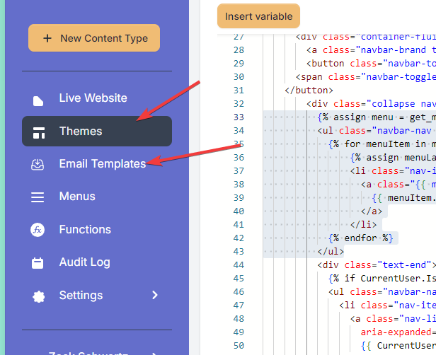
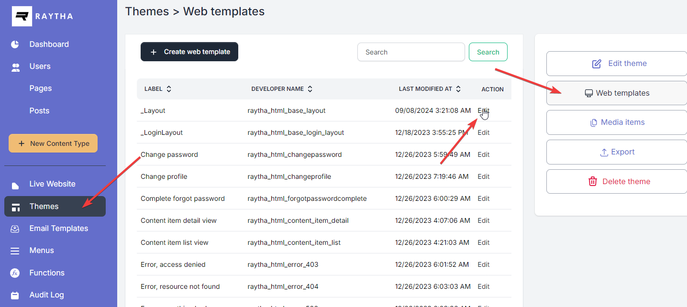

# Build custom Raytha templates

## Migrate a static site to a CMS

We highly recommend watching our YouTube video where we demonstrate the process of migrating a static website hosted on Github Pages to the Raytha platform. By following along with the video, you can gain valuable insights and learn how to successfully migrate your own website.

## Introduction to Raytha templates

Raytha templates are built using the Liquid syntax, which is a popular templating language that utilizes the widely-used [.NET Fluid library](https://github.com/sebastienros/fluid) for rendering. Liquid is a well-established templating engine that powers many Shopify websites, making it a trusted and reliable option for developers.

To view the liquid syntax in more detail, you can refer to the official Shopify documentation available at [https://shopify.github.io/liquid/basics/introduction/](https://shopify.github.io/liquid/basics/introduction/).

Out of the box, Raytha provides a basic template that serves as a starting point for developers who want to dive straight into the development process. However, if you prefer to create your own custom template from scratch, you have the flexibility to do so.

Raytha's liquid templates are stored in the database, and can be easily modified by accessing the Templates section in the Raytha Admin panel. To access this section, simply click on the Templates sidebar as shown in the image below:

## Understanding parent/child templates

To effectively build Raytha templates, it's important to grasp the concept of creating a layout template that can be inherited by other templates. By default, all users are given a `_Layout` parent template.

When you create or modify a Raytha template, it's important to understand that you can choose to inherit from a parent template and also specify whether the template you're creating will serve as a parent to other templates.

In case you are creating a parent template, make sure to include the `` tag in your HTML code, otherwise, an error will be thrown. This tag is essential as it indicates where the content of the child template will be rendered.

> Note: There is a depth limit for inheretence of 5 levels deep.

## Explanation of variables

To get the most out of Raytha templates, it's essential to understand the role of variables. With Raytha, variables and liquid syntax allow for full flexibility in rendering the content types you have configured. To insert a variable, simply open the template you want to edit and click on the "Insert variable" button. From there, you can search for the desired variable and copy and paste it into the template editor. By mastering variables and liquid syntax, you can take full control of your templates and achieve the desired rendering for your content.

There are many variables available to you. Below are some of the common ones you might find yourself using regularly.

| Variable                                | Type              | Notes                             |
| -----------------------------------     | ------------------|---------------------------------- |
| QueryParams                             | Key-Value         | {{ QueryParams['yourParam'] }}    |
| PathBase                                | String            | If site is hosted at a /route     |
| CurrentUser.IsAuthenticated             | Boolean           |                                   |
| CurrentUser.IsAdmin                     | Boolean           |                                   |
| CurrentUser.Roles                       | Array             |                                   |
| CurrentUser.UserGroups                  | Array             |                                   |
| CurrentUser.LastModificationTime        | Date              |                                   |
| CurrentUser.UserId                      | String            |                                   |
| CurrentUser.FirstName                   | String            |                                   |
| CurrentUser.LastName                    | String            |                                   |
| CurrentUser.EmailAddress                | String            |                                   |
| CurrentOrganization.OrganizationName    | String            |                                   |
| ContentType.LabelPlural                 | String            |                                   |
| ContentType.LabelSingular               | String            |                                   |
| ContentType.DeveloperName               | String            |                                   |
| ContentType.Description                 | String            |                                   |
| Target                                  | Object            |                                   |
| Target.Items                            | Array             |                                   |

The `Target` variable is a crucial component in Raytha templates, as it is linked to the content being rendered. Its value is either the list of content items if the template is a list view or the individual content item if the template is a detail view. More information about how Target is used in each context is described in the [detail vs list views article](/articles/templates_detail_vs_list.html).