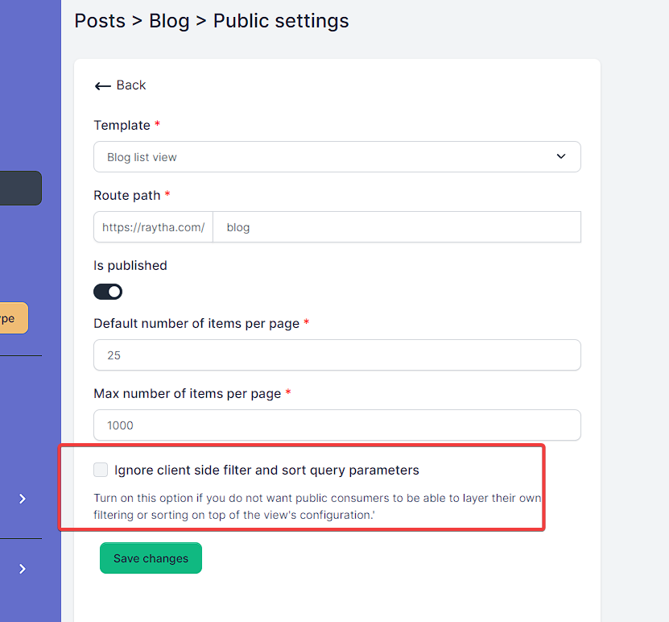
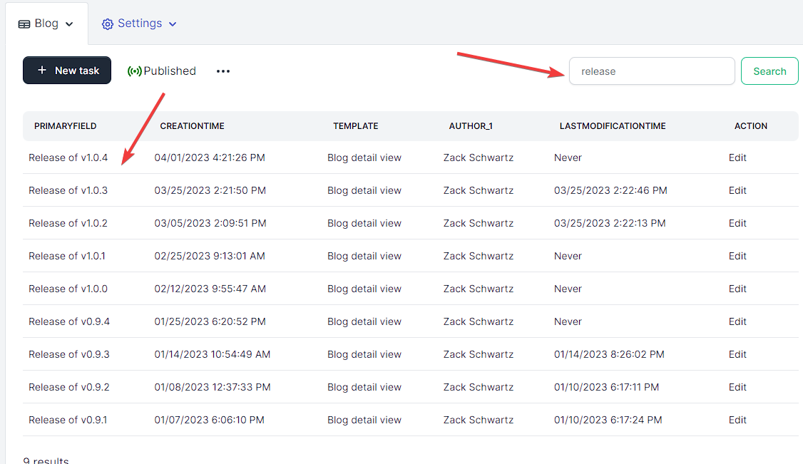

# Using OData with Raytha liquid templates

OData (Open Data Protocol) is a standardized protocol that provides a powerful filtering language that allows clients to retrieve only the data they need. The filtering system is based on a standardized syntax and supports a wide range of filter conditions, including comparison operators, logical operators, functions, and parentheses for grouping conditions. Clients can filter data based on multiple criteria, such as date ranges, numeric values, or string patterns, and can also perform complex queries with nested conditions.

You can learn more about [OData syntax on Microsoft's documentation](https://learn.microsoft.com/en-us/dynamics-nav/using-filter-expressions-in-odata-uris).

Raytha's list view engine applies the OData standard to filtering and sorting on data within Raytha content types.

When you [create a view in the Raytha admin portal](https://raytha.com/user-guide/modify-create-and-publish-a-list-view), Raytha is storing an OData filter query and runs that for you when you visit the List View on the public site. This is the "base" filter, but Raytha gives you the ability to layer additional filters and sorting on top of this base.

There may be a case where you do not this functionality enabled. You can disable the public odata filtering by going into the public settings for the list view and checking the box for `Ignore client side filter and sort query parameters`

## Filter

Take the Raytha blog list view: [https://raytha.com/blog](https://raytha.com/blog). You can apply OData filters to this view. Raytha will first apply the filter set on the view in the admin portal's settings, and then *also* apply any additional filter specified in the url's `filter` query parameter. 

This feature is immensely helpful if you want to create a sidebar menu that filters on categories, for example.

Below are some examples:

* [https://raytha.com/blog?filter=PrimaryField eq 'Release of v1.0.4'](https://raytha.com/blog?filter=PrimaryField%20eq%20%27Release%20of%20v1.0.4%27)
* [https://raytha.com/blog?filter=CreationTime lt '3/1/2023'](https://raytha.com/blog?filter=CreationTime%20lt%20%273/1/2023%27)
* [https://raytha.com/blog?filter=CreationTime lt '3/1/2023' and youtube_video ne ''](https://raytha.com/blog?filter=CreationTime%20lt%20%273/1/2023%27%20and%20youtube_video%20ne%20%27%27)
* [https://raytha.com/blog?filter=((CreationTime lt '3/1/2023' and youtube_video ne '') or hide_author_bio eq 'true')](https://raytha.com/blog?filter=((CreationTime%20lt%20%273/1/2023%27%20and%20youtube_video%20ne%20%27%27)%20or%20hide_author_bio%20eq%20%27true%27))
* [https://raytha.com/blog?filter=contains(title, 'open source')](https://raytha.com/blog?filter=contains(title,%20%27open%20source%27))

As you can see, you can use parantheses to effectively have sub-queries, and compare any field on the content type.

The system fields you can filter on are:

* PrimaryField
* CreationTime
* LastModificationTime
* IsPublished
* IsDraft

Supported OData Operators in Raytha:

* and, or
* eq, ne, lt, lte, gt, gte
* contains(field, '...'), starstwith(field, '...'), endswith(field, '...') 

You can also use `null` to test for null values such `category ne null`.

## Order By

By using the `orderby` query parameter with the `asc` or `desc` direction. And you can sort on multiple properties via comma separated clauses. This will override what is set on the view in the admin portal.

Some examples:

* [https://raytha.com/blog?orderby=title asc](https://raytha.com/blog?orderby=title%20asc)
* [https://raytha.com/blog?orderby=youtube_video desc,CreationTime asc](https://raytha.com/blog?orderby=youtube_video%20desc,CreationTime%20asc)

## Pagination

Use the `pageSize` and `pageNumber` query parameters to run through pagination of a list view.

Some examples:

* [https://raytha.com/blog?pageSize=1&pageNumber=2](https://raytha.com/blog?pageSize=1&pageNumber=2)
* [https://raytha.com/blog?pageSize=5](https://raytha.com/blog?pageSize=5)

## Search

On the admin portal, you can run an open search on your list view which will only search on the columns that you have chosen to display on that view.

This functionality flows out to the public view.

Example:

* https://raytha.com/blog?search=release

> Note: If you want to search on columns that are not selected for the view in the admin portal, then you should construct an OData filter using the contains() function described above.